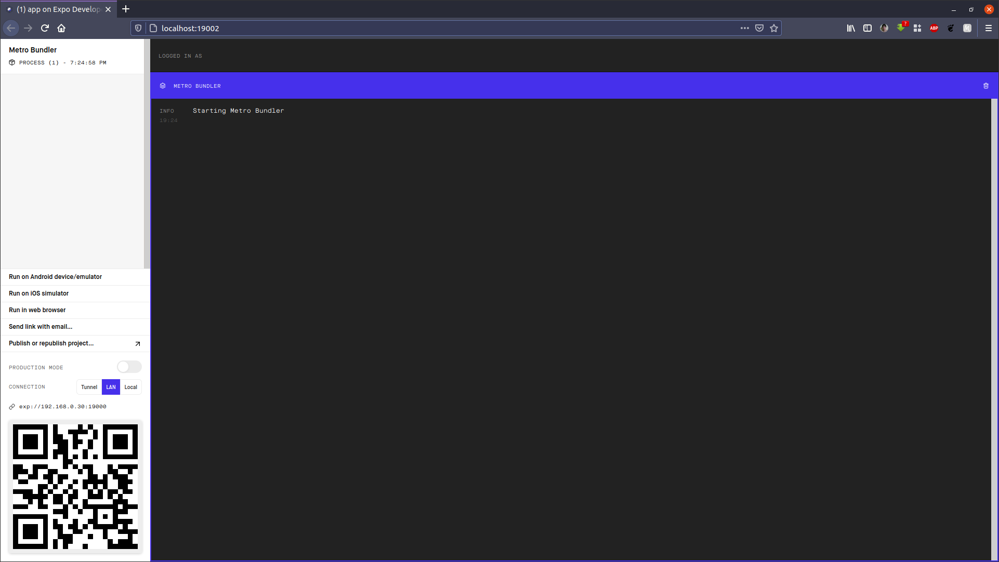
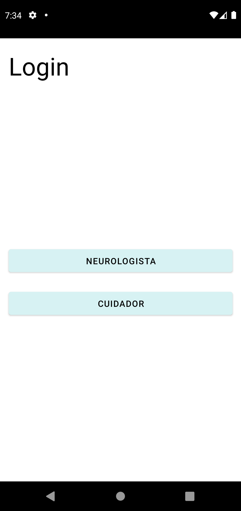
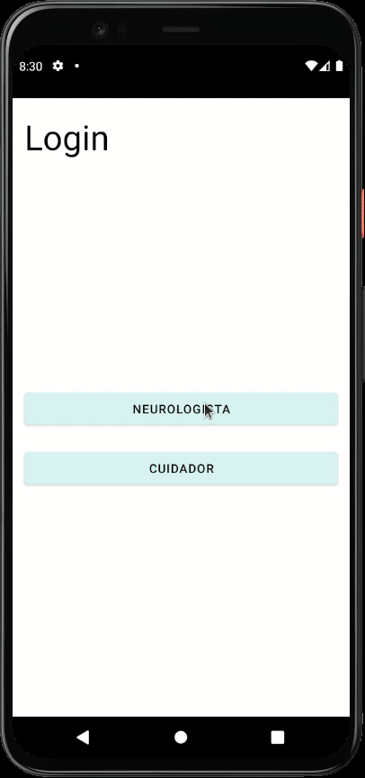
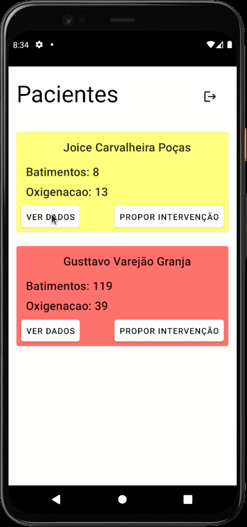
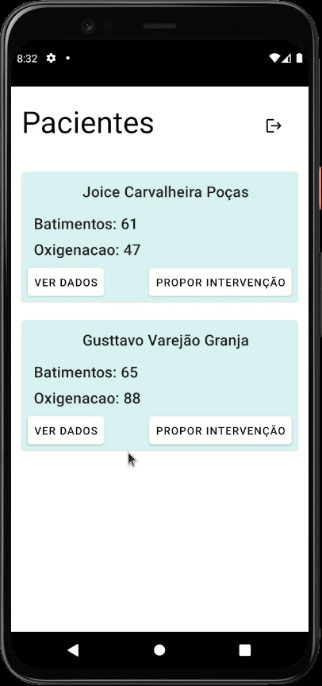
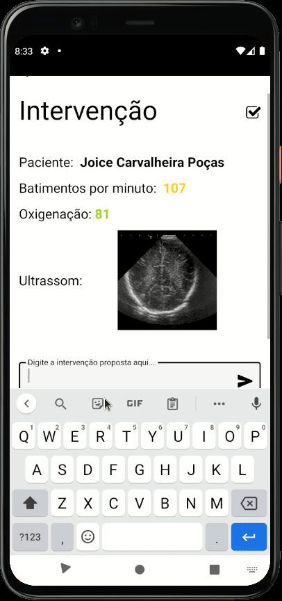

# projeto_iv_dispositivos_moveis

Seleção para o Edital 03/2021 do Laboratório de Inovação Tecnológica em Saúde

Desenvolver uma aplicação que consiste em um aplicativo de monitoramento em tempo real dos dados vitais de pacientes em homecare​.Esses dados serão recebidos por um sistema servidor, que será compartilhado entre os módulos do cuidador e do neurologista.

# Índice
+ [Configurando o ambiente](#configuracao)
+ [Api](#api)
+ [Aplicativo](#aplicativo)
    - [Rota do Neurologista](#neurologista)
    - [Rota do Cuidador](#cuidador)
+ [Melhorias e ideias](#melhorias)


<h1 id="configuracao">Configurando o ambiente</h2>

Para a execução desse projeto, são necessárias a instalação de certos pacotes para que tudo funcione como deve.

Para a api é necessário possuir o Python na versão 3.6 ou superior.

Com o python instalado, basta por no terminal esses dois comandos:

`pip install fastapi` 

`pip install uvicorn[standard]`

Após a instalação, já é possível executar o servidor, basta navegar para a pasta `/servidor/`

`$ uvicorn api:app --reload --host 0.0.0.0 --port 3000`

Logo após já é possível acessar a documentação da api no seguinte endereço:

`http://127.0.0.1:3000/docs#/`

Em seguida, pode-se executar o script para envio de dados para o servidor, com o seguinte comando:

`python paciente_1.py`

Para o aplicativo, basta seguir o seguinte tutorial, nele está explicado como configurar o ambiente android, com emulador.

`https://react-native.rocketseat.dev/android/linux/`

Após a configuração do ambiente, é necessário instalar o Expo, para isto basta digitar no terminal:

`npm install --global expo-cli`

Quando acabar a instalação, basta navegar para a pasta `/app/` e executar o comando:

`expo start`

A seguinte janela irá se abrir no navegador e será possível abrir emuladores por ela, ou escanear o qrcode para abrir o aplicativo no próprio dispositivo pelo aplicativo `Expo Go`

<div align="center">
    <p float="left">
        
    <p>Figura 1. Expo Developer</p>
    </p>
</div>


<h1 id="api">API</h2>

A Api foi construída em python com o framework FASTAPI, ela possui GETs para obter os pacientes e PUTs para atualizar as informações, um script
vai fornecer os dados, emulando os aparelhos e dados vitais. 

Exemplo do modelo de paciente:

```python
class Paciente(BaseModel):
    nome: str = ''
    oxigenacao: float
    severidade_oxigenacao: float
    batimento_cardiaco: float
    severidade_batimento_cardiaco: float
    ultrassom: str = ''
    intervencao: str = ''
```

Exemplo de get:


```python
@app.get('/paciente/{paciente_id}')
def get_paciente_id(paciente_id: int):
    return db[paciente_id-1]
```

Exemplo de put:

```python
@app.put('/paciente/{paciente_id}/intervencao')
def update_intervencao(paciente_id: int, dados: Intervencao):
    stored_paciente_data = db[paciente_id-1]
    stored_paciente_model = Paciente(**stored_paciente_data)
    update_data = dados.dict(exclude_unset=True)
    updated_paciente = stored_paciente_model.copy(update=update_data)
    db[paciente_id-1] = jsonable_encoder(updated_paciente)
    return updated_paciente
```

Com a estrutura de post, gets, puts e deletes prontas, foi implementado os scripts que geram os dados para o aplicativo

```python
def main():
    cria_paciente(nome[random.randint(0,8)])
    atualiza_ultrassom(imagens[random.randint(0,4)])

    a = 0
    while(1):
        dados_pessoa = atualiza_dados(random.randint(0,120), (random.randint(0,120)))
        fila.put(dados_pessoa)
        print(dados_pessoa)
        sleep(1)
        a = a + 1
        if (a == 600):
            atualiza_ultrassom(imagens[random.randint(0,4)]) 
            a=0
```

Para definir a severidade dos sinais, foi utilizada a seguinte função

```python
def define_severidade(dado: float):
    if(dado >= 115 or dado <= 5):
        return 1
    elif(dado >= 105 and dado < 115 or dado <= 15 and dado > 5):
        return 2
    elif(dado < 105 and dado > 15):
        return 3  
```

Foi adotado que os dados maiores que 115 ou menores que 5 como severos, entre 105 e 115 e entre 5 e 15 como moderados, os demais valores como normais.

Para a prioridade das requisições, foi utilizada uma fila de prioridade, na qual quanto menor o indice de severidade, maior a prioridade.

<h1 id="aplicativo">Aplicativo</h2>


<div align="center">
    <p float="left">
        
    <p>Figura 2. Tela inicial</p>
    </p>
</div>

O aplicativo foi desenvolvido utilizando React Native, TypeScript e Expo.

A implementação dele partiu da criaçao de duas rotas, uma para o cuidador e uma para o neurologista, botões simulam o login ao abrir o aplicativo.
A escolha da rota é feita com a alteração de estado, fazendo que as telas só sejam montadas ao selecionar o login.

```javascript
    <NavigationContainer>
        {user ? (isNeurologista ? (<NeurologistaRoute/> ) : (<CuidadorRoute/>)) : (
        <Stack.Navigator screenOptions={{
          header: ()=> null
        }}>
          <Stack.Screen name='Login' component={Login}/>
        </Stack.Navigator>)}
    </NavigationContainer>
```

<h2 id='neurologista'><b>Neurologista</b></h3>

O módulo do neurologista consiste em basicamente três telas, uma home page que exibe todos os pacientes, uma tela que exibe os dados detalhados de um paciente específico e uma tela para enviar intervenções.

<div align="center">
    <p float="left">
        
    <p>Figura 3. Cards indicando o grau de severidade</p>
    </p>
</div>

Nesta tela os cards alteram sua cor de acordo com os dados vitais do paciente, o vermelho representa severo, o amarelo moderado e o azul baixo, além de alterar as cores para uma melhor visualização geral do estado do paciente, tambem é exibido um alerta quando o paciente está no nível severo ou moderado.

<div align="center">
    <p float="left">
        
    <p>Figura 4. Tela de dados</p>
    </p>
</div>

Ao clicar em ver dados, o usuário é redirecionado para a página pessoal do paciente, lá os dados são atualizados em tempo real, para melhor acompanhamento, por lá também é possível propor uma intervenção.


<div align="center">
    <p float="left">
        
    <p>Figura 5. Alerta do paciente</p>
    </p>
</div>

Após receber um alerta é possível propor uma intervenção ao cuidador imediatamente, ao fazer uma intervenção o status é alterado e é possível saber quando o cuidador executa a intervenção.


<div align="center">
    <p float="left">
        
    <p>Figura 6. Tela de intervenção</p>
    </p>
</div>

Quando o ícone se altera para vazio, significa que uma intervenção foi enviada, quando o cuidador confirma ela, o ícone se altera para concluído.

<h2 id='cuidador'><b>Cuidador</b></h3>

O módulo do cuidador se assemelha com o do neurologista, nele é possível ver os dados do paciente de forma rápida no card da home page, o módulo do cuidador também possui uma tela que exibe os dados em tempo real, por lá é possível notificar alterações.

<div align="center">
    <p float="left">
        
    <p>Figura 7. Alerta de intervenção sugerida</p>
    </p>
</div>

De modo semelhante ao neurologista, é possível enviar uma alteração.

Por ultimo e não menos importante, as homes possuem um botão de logoff para deslogar do usuário.

<h1 id="melhorias">Planos futuros</h2>

Além do proposto como feature bônus, as notificações, durante o desenvolvimento percebi que uma coisa que melhoraria muito a aplicação seria a conexão com um banco de dados, com isso seria possível observar o histórico do paciente, além de poder gerar gráficos para melhorar a visualização de dados ao longo do tempo, também seria interessante implementar um chat, para que o cuidador pudesse tirar eventuais dúvidas com o médico. 

Como o aplicativo é dedicado ao home care, também poderia ser implementado um módulo para o cuidador gerenciar medicamentos, assim poderiam haver notificações nos horários de tomá-los, além do médico poder acompanhar se o tratamento está sendo seguido e podendo ver em tempo real o quadro do paciente para poder receitar ou suspender determinados medicamentos e também alterar doses.